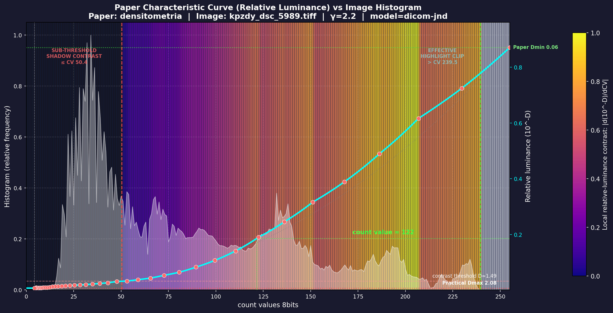
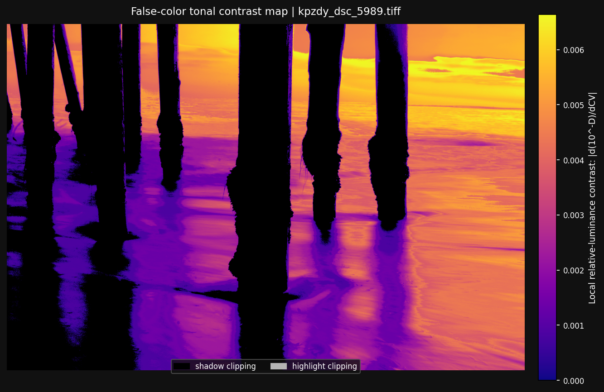
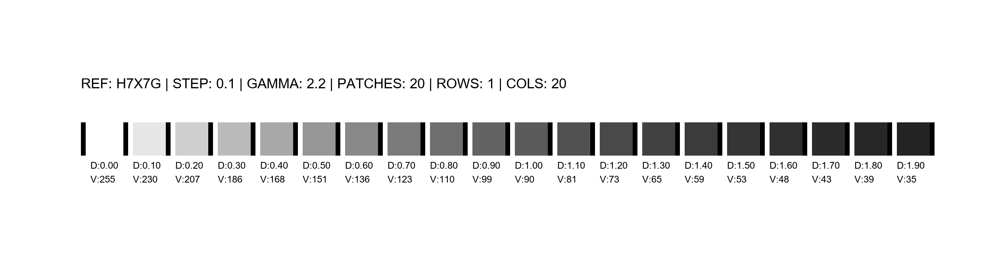

# Contrast Analysis and Tonal Proofing Tools

This repository contains a set of tools designed to analyze the tonal response of photographic and fine-art papers, and compare it with the content of real images to identify tonal clipping and loss of detail.

---

## 1. contrast_proof.py

This script analyzes the measured characteristic curve of a paper (from a CGATS file) and overlays it onto an image histogram. Its main objective is to determine the useful tonal range of the paper and detect where shadows or highlights stop reproducing perceptible differences.

### Main Parameters

| Parameter | Description | Default |
|-----------|-------------|---------|
| `--cgats-path`, `--cgats` | Path to the CGATS file with density and L* measurements. | `papeles\H_FineArte_Baryta_FB_350\Patch-Reader_chart.txt` |
| `--image-path`, `--image` | Path to the tiff/jpg/png image to analyze. | `test-imgs\rbdey_antilope_2.tiff` |
| `--gamma` | Gamma used for the Density/CV relationship. | `2.2` |
| `--nominal-density-step` | Nominal increment between chart patches. | `0.1` |
| `--plot-output` | Output path for the comparative plot. | `output\contrast_proof_plot.png` |
| `--false-color-output` | Output path for the false color contrast map. | `output\contrast_proof_false_color.png` |

### Perceptual Analysis Parameters (DICOM JND)

| Parameter | Description | Default |
|-----------|-------------|---------|
| `--contrast-model` | Detection model: `dicom-jnd` or `density-gain`. | `dicom-jnd` |
| `--jnd-threshold` | Maximum ΔJND threshold to consider detail visible. | `1.5` |
| `--lstar-step-threshold`| Maximum ΔL* increment between samples. | `1.5` |
| `--contrast-decision` | Rule to combine metrics: `any` (sensitive) or `all` (strict). | `any` |
| `--paper-white-luminance`| Paper white luminance in cd/m². | `150.0` |
| `--shadow-min-patches` | Consecutive sub-threshold patches to declare clipping. | `4` |
| `--shadow-max-gap-patches`| Allowed noise gaps in the clipping zone. | `1` |

### Other Parameters

- `--show-lstar`: Shows the measured L* curve in the plot.
- `--exclude-samples`: List of patches to ignore (e.g., `R2,S2,T2`).
- `--linear-y`: Uses a linear scale for density (logarithmic by default).
- `--relative-luminance-y`: Changes the Y-axis to relative luminance (10^-D).
- `--shadow-dmax-mode`: Dmax calculation method (`tail-median`, `percentile`, `manual`).

### Output Examples

| Curve vs Histogram Analysis | Contrast Map (False Color) |
|:---:|:---:|
|  |  |

---

## 2. densitometric_scale.py

Custom densitometric scale generator for printing and subsequent measurement. It generates a PNG image with patches of increasing density, informative legends, and control marks for spectrophotometers.



### CLI Parameters

| Parameter | Description | Default |
|-----------|-------------|---------|
| `--step` | Density increment between patches (e.g., 0.1, 0.05). | `0.1` |
| `--max_d` | Maximum density value in the scale. | `2.5` |
| `--rows` | Number of rows (automatically calculated if omitted). | `None` |
| `--paper` | Paper size: `A4` or `A3`. | `A4` |
| `--patch_size`| Size of each square patch in millimeters. | `7.0` |
| `--gamma` | Density -> Pixel conversion gamma. | `2.2` |
| `--output` | Output image filename. | `escala_densidad.png` |

### Design Details
- **Spacers**: Each patch has a 2mm spacer (1mm black + 1mm white) at the beginning and end to guide the spectrophotometer.
- **Smart Layout**: All rows have the same number of columns. If the total number of patches is not divisible, the script throws an error to avoid incomplete grids.
- **Borderless**: Patches have no black border to avoid interference with measurements.
- **Metadata**: Includes Random Reference, Step, Gamma, Total Patches, Rows, and Columns in the top margin.

---

## Installation and Dependencies

Requires Python 3.x and the following libraries:

```powershell
pip install numpy opencv-python matplotlib pillow
```

## Example Workflow

1. **Generate Scale**:
   ```powershell
   python densitometric_scale.py --step 0.05 --paper A4 --output test_scale.png
   ```
2. **Print and Measure**: Print the scale without color management and measure it with a spectrophotometer to obtain a CGATS file (D_VIS, LAB_L).
3. **Analyze Image**:
   ```powershell
   python contrast_proof.py --cgats measurement.txt --image my_photo.tif --contrast-model dicom-jnd
   ```
